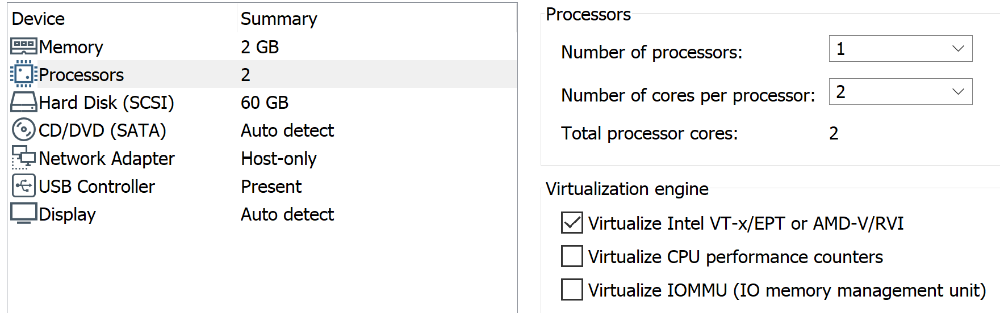
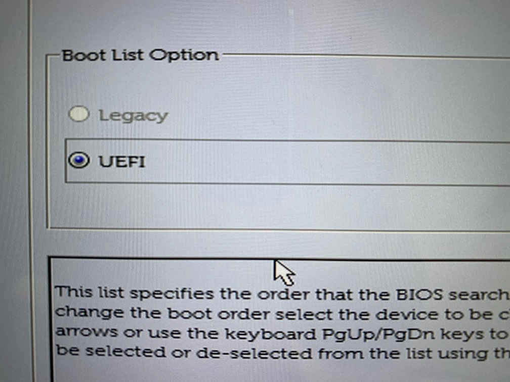
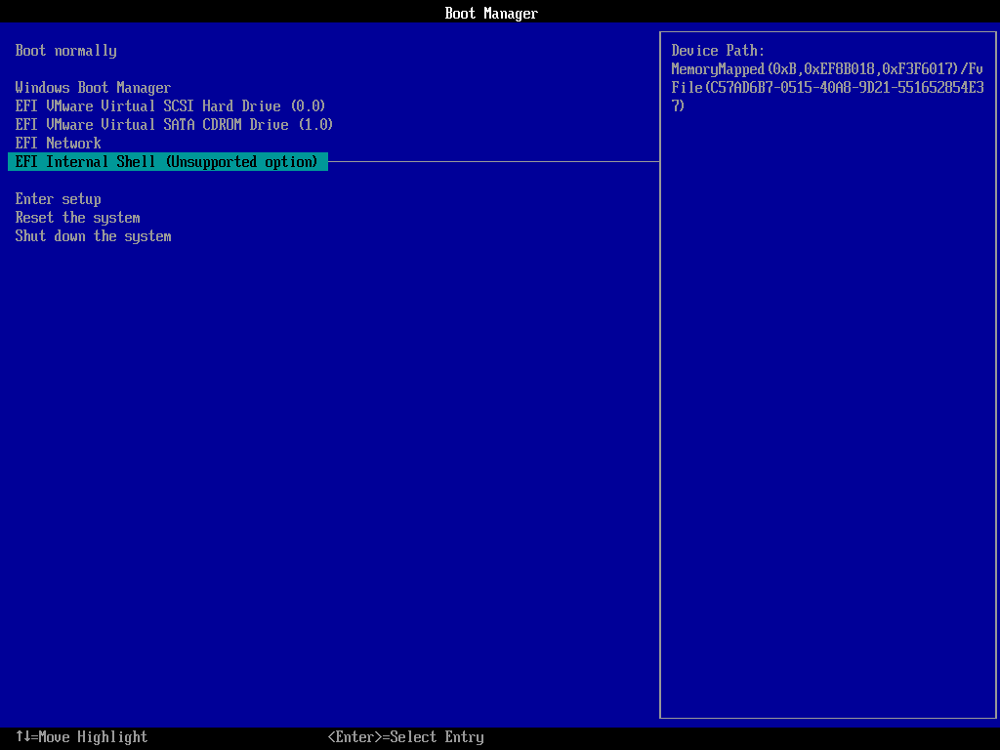
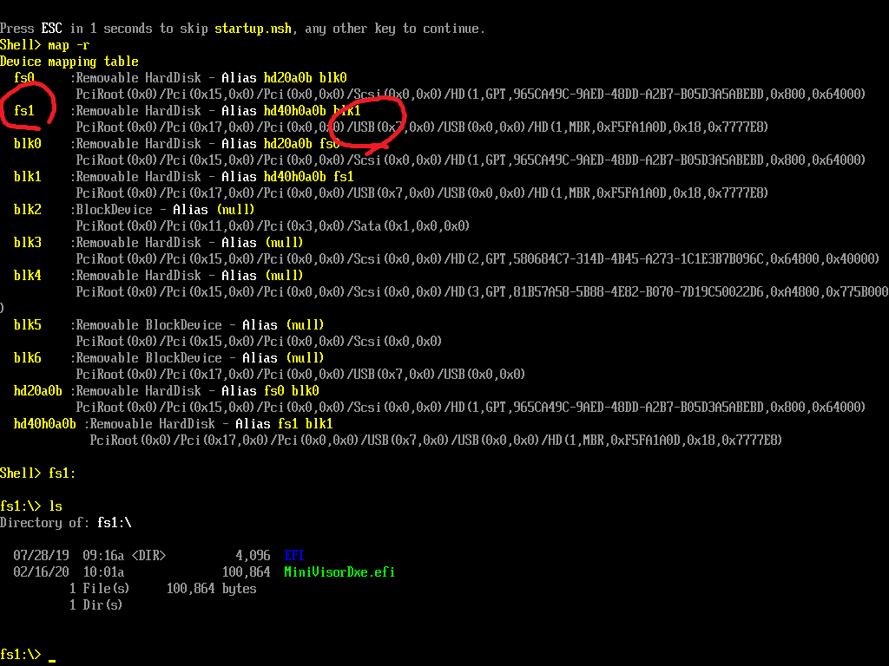
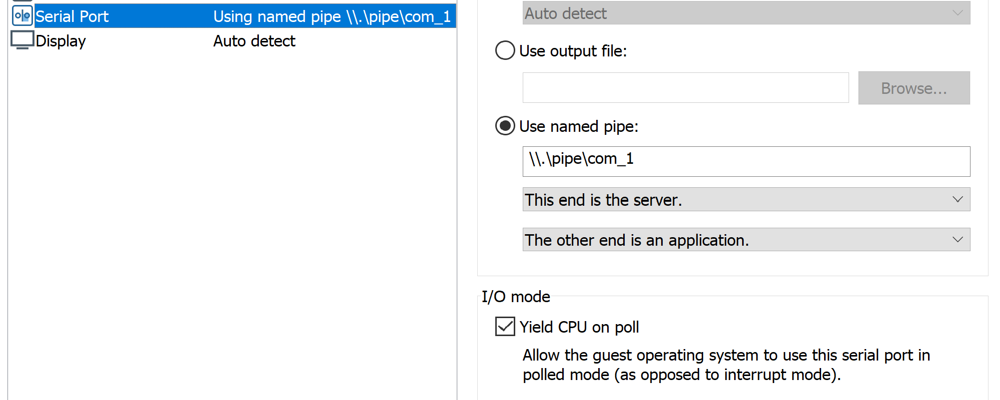
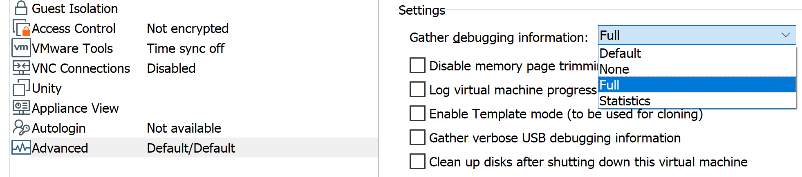
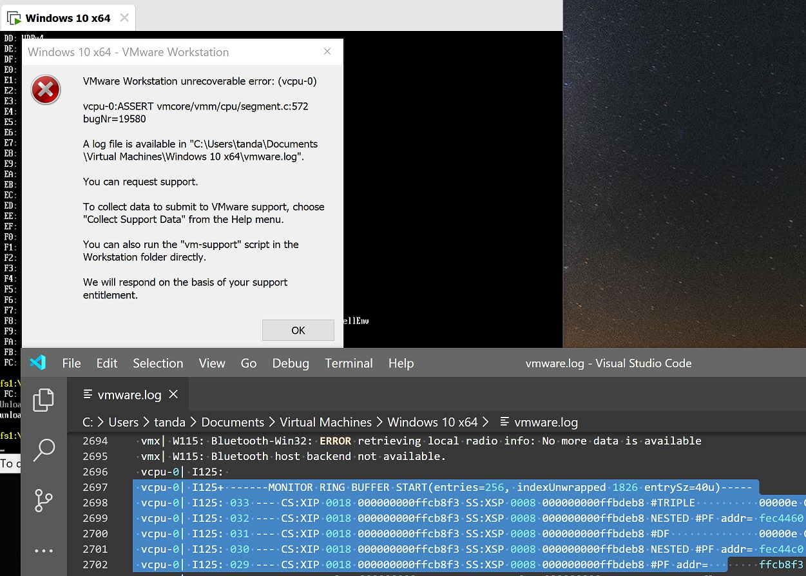
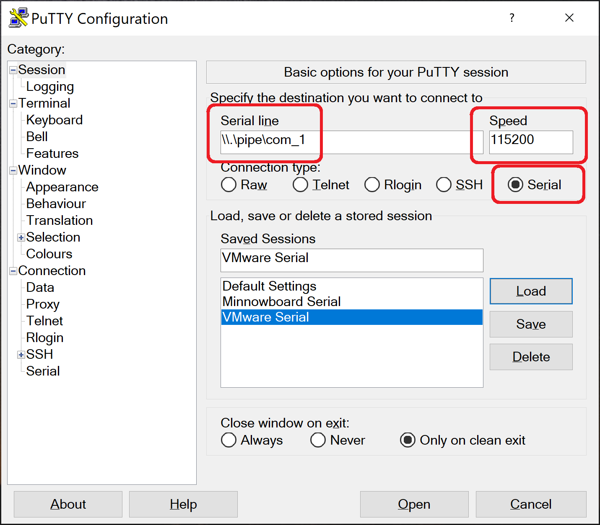
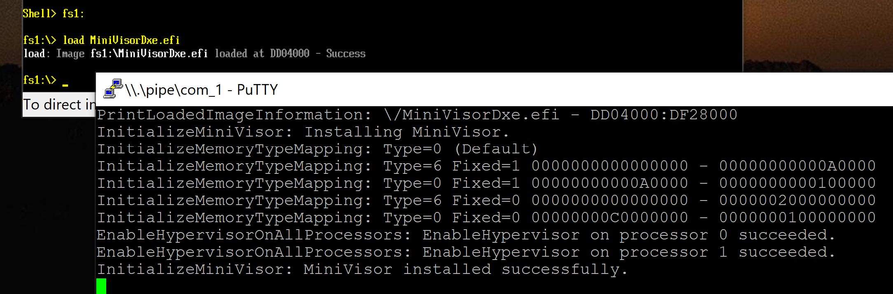
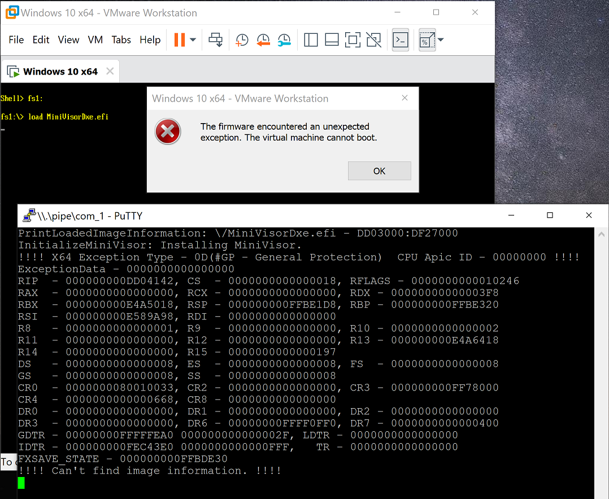

Building and Debugging
=======================

This document provides step-by-step instructions to build and debug MiniVisor for both UEFI and Windows driver configurations.

Common Build Prerequisites
---------------------------

To build MiniVisor, the followings are required.
* [Visual Studio Community 2019](https://www.visualstudio.com/downloads/)
* [Windows Software Development Kit (SDK) for Windows 10](https://developer.microsoft.*om/en-us/windows/downloads/windows-10-sdk) 10.0.18362 or later
* [Windows Driver Kit (WDK) for Windows 10](https://developer.microsoft.com/en-us/windows/hardware/windows-driver-kit) 10.0.18362 or later

Terms
------

In this document, the "host" system refers to the system that builds MiniVisor and runs debugger. It may also run the target system as a virtual machine.

The "target" system refers to the system that loads MiniVisor". This can be a separate bare-metal machine or a virtual machine running inside the host system.

UEFI: Building the Driver
--------------------------

The below instructions are all to be done on the host system.

1. Setup EDK2, by follow the official instructions at [tianocore.github.io](https://github.com/tianocore/tianocore.github.io/wiki/Windows-systems). This is mainly made up of those steps below as demonstrated.

    1. Installing Python, NASM, and the ASL Compiler,
        ```
        > C:\ASL\iasl.exe -v
        ...
        ASL+ Optimizing Compiler/Disassembler version 20191018
        > set NASM_PREFIX=C:\Users\tanda\AppData\Local\bin\NASM\
        > set PYTHON_HOME=C:\Users\tanda\AppData\Local\Programs\Python\Python38
        ```
    2. Cloning the EDK2 repository,
        ```
        > cd C:\
        > git clone https://github.com/tianocore/edk2.git
        > cd edk2
        > git submodule update --init
        ```
    3. Editing Conf\target.txt, and
        ```
        > edksetup.bat Rebuild
        (Warnings here is ok)

        > notepad Conf\target.txt
        ---
        #ACTIVE_PLATFORM       = EmulatorPkg/EmulatorPkg.dsc
        ACTIVE_PLATFORM       = MdeModulePkg/MdeModulePkg.dsc
        ...
        #TOOL_CHAIN_TAG        = VS2015x86
        TOOL_CHAIN_TAG        = VS2019
        ---
        ```
    4. Running test build
        ```
        > edksetup.bat
        (Warnings here is ok)

        > build -a X64 -t VS2019 -b NOOPT
        ...
        - Done -
        Build end time: 18:54:14, Feb.04 2020
        Build total time: 00:01:35

        > dir /s Build\MdeModule\NOOPT_VS2019\X64\HelloWorld.efi
        (You should see multiple entries under C:\edk2\Build\)
        ```

2. Checking out MiniVisorPkg inside the `edk2` folder

    ```
    > cd C:\edk2
    > git clone https://github.com/tandasat/MiniVisorPkg.git
    ```

3. Building MiniVisorPkg

    ```
    > cd C:\edk2
    > edksetup.bat
    > build -w -a X64 -t VS2019 -b NOOPT -p MiniVisorPkg\Builds\Platform\EFI\MiniVisorPkg.dsc
    > dir /s MiniVisorDxe.efi
    (You should see multiple entries under C:\edk2\Build\)
    ```

UEFI: Preparing the Target System
----------------------------------

The target system must be a UEFI-based x64 system without Secure Boot and be able to boot one of the supported operating systems.

In the case of virtual machines, only VMware Workstation is supported. For the other possible configurations, see the below sections. With VMware Workstation, make sure that
* `Virtualize Intel VT-x/EPT or AMD-V/RVI` is checked,
* in the `Advanced` section, `UEFI` is selected, and
* `Enable secure boot` is unchecked.




In the case of bare-metal, some UEFI-based systems enable the "legacy BIOS" mode to boot the operating system. This mode is essentially equivalent to using old fashioned BIOS and not supported by this project. Changing the mode is possible in the UEFI settings but will render the existing operating system unbootable. Here is the example with Dell UEFI settings configured to boot the system with the UEFI mode.


UEFI: Loading the Driver
-------------------------

In this instruction, we will boot the target system into the UEFI shell, load MiniVisorDxe.efi from the USB thumb-drive and boot Windows.

1. Prepare USB thumb-drive
    1. Format the USB thumb-drive to FAT32. This page assumes that the USB drive is mounted as `D:\` on the host Windows.

        The Windows default GUI tool does not offer the FAT32 format option for the USB driver bigger than 32GB. Use a smaller device or the `format` command instead, for example,
        ```
        > format /FS:FAT32 D:
        ```

    2. Download pre-compiled the UEFI shell from the EDK2 repository ([Download](https://github.com/tianocore/edk2/raw/edk2-stable201903/ShellBinPkg/UefiShell/X64/Shell.efi)). This instruction assumes the file is downloaded as `%USERPROFILE%\Downloads\Shell.efi`

    3. Deploy the UEFI shell as `Bootx64.efi`, so it can be started automatically.

        ```
        > cd /d D:\
        > mkdir EFI\Boot
        > copy %USERPROFILE%\Downloads\Shell.efi EFI\Boot\Bootx64.efi
        ```

2. Deploy MiniVisorDxe.efi to the USB drive

    ```
    > copy /y C:\edk2\Build\MiniVisor\NOOPT_VS2019\X64\MiniVisorDxe.efi D:\
    ```

3. Boot the target system into UEFI settings

    In the case of bare-metal, this requires device specific operations. Most of systems require to press F2, F12, or DEL key during the early boot phase.

    With VMware Workstation, select `Power On to Firmware` from the `Power` menu.

4. Start the EFI shell

    This requires UEFI specific operations. Typically, you can either find the `EFI Internal Shell` option or select the USB drive as a boot device, as we copied the UEFI shell as `Bootx64.efi` already.

    If neither of them is found, reboot the target system into the boot device selection menu. For example, UEFI settings on Dell XPS devices do not offer those options, and instead, booting the device with the F12 key enters the boot device selection menu.

    VMware Workstation offers `EFI Internal Shell (Unsupported option)`.
    

5. Select the filesystem

    1. Run `map` command to list the available filesystems. Identify one that has `USB` in the path. We assume that is `fs1:` in this instruction.
        * If not found, USB might not be recognized. Make sure it is accessible from the target system and run `map -r` to refresh the list.
    2. Run `fs1:` to move to the filesystem.
    3. Run `ls` command and make sure `MiniVisorDxe.efi` exists.

    

6. Load the driver and boot Windows

    1. Load the the driver and exit from the shell

        ```
        fs1:\> load MiniVisorDxe.efi
        ...
        Image 'fs1:\MiniVisorDxe.efi' loaded at 77564000 - Success

        fs1:\> exit
        ```

    2. Select the boot manager for Windows. This is typically `Windows Boot Manager`. Windows should boot as usual other than some logs may appear on display.

Unloading the driver after operating system boot is unsupported.

UEFI: Building the Project on Visual Studio
--------------------------------------------

__Once the project is built with EDK2__, you may build it on Visual Studio with the following steps:

1. Open `MiniVisorPkg\Builds\MiniVisor.sln` with Visual Studio
2. Select `UEFI` build configuration (Default will be `Debug`, which produces the Windows driver)
3. Run `Build Solution`

Visual Studio will produce output as `C:\edk2\MiniVisorPkg\Builds\x64\UEFI\MiniVisorDxe.efi`. This binary is always compiled for debugging without optimization.

UEFI: Build Customization
--------------------------

* Building optimized build

    For optimized binary file, use EDk2's `build` command with the `-b RELEASE` parameter.
    ```
    > build -w -a X64 -t VS2019 -b RELEASE -p MiniVisorPkg\Builds\Platform\EFI\MiniVisorPkg.dsc
    ```

* Enabling Serial Logging

    By default, the UEFI driver uses console output for logging. This can be switched to use serial output by building the project with `-D DEBUG_ON_SERIAL_PORT` parameter.
    ```
    > build -w -a X64 -t VS2019 -b NOOPT -p MiniVisorPkg\Builds\Platform\EFI\MiniVisorPkg.dsc -D DEBUG_ON_SERIAL_PORT
    ```

    For more details of logging with serial output, see the below section.

UEFI & Windows: Testing Existence of MiniVisor
-----------------------------------------------

One can verify that MiniVisor has virtualized all processors by executing the accompanying test program called `CheckHvVendor`.

This program can be compiled into both for Windows and Linux.

* For Windows, open `MiniVisorPkg\Tests\CheckHvVendor\CheckHvVendor.sln` with Visual Studio and compile it with `x64` + `Release` configuration.
* For Linux, compile `MiniVisorPkg\Tests\CheckHvVendor\CheckHvVendor\CheckHvVendor.cpp` with `g++`.

Once compiled, deploy the executable onto the target system and run from the terminal. The output should contain `MiniVisor` if MiniVisor is successfully installed.

```
> CheckHvVendor.exe
Executing CPUID(0x40000000) on CPU 0
Result: MiniVisor
Executing CPUID(0x40000000) on CPU 1
Result: MiniVisor
Executing CPUID(0x40000000) on CPU 2
Result: MiniVisor
Executing CPUID(0x40000000) on CPU 3
Result: MiniVisor
```

UEFI: Configuring VMware Virtual Machine for Debugging
-------------------------------------------------------

It is recommended to configure all of them for debugging the UEFI driver.

* Enabling the GDB debug stub

    This allows you to connect to the virtual machine using one of the debuggers listed below.

    To enable the debug stub, shut down the virtual machine, open the VMX file associated with the virtual machine and add those lines:
    ```
    debugStub.listen.guest64 = "TRUE"
    debugStub.hideBreakpoints = "TRUE"
    ```

    To connect to the virtual machine using IDA Pro, see instructions explained in [this blog post](https://www.triplefault.io/2017/07/setup-vmm-debugging-using-vmwares-gdb_9.html). WIth GDB, use the target command.
    ```
    $ gdb
    gdb$ target remote localhost:8864
    ```

* Adding a serial device for logging

    This allows you to see logs for an extended period of time, compared with console output, as well as register dump by VMware in some case of an unhandled exception.

    Add the serial device using the named pipe. Make sure `This end is the server` and `The other end is an application` are selected.
    

    The below section explains how to see logs sent to the serial device.

* Enabling Full debug logging

    This allows you to see extended logs in `vmware.log` file in case the virtual machine encounters critical error such as triple fault.

    To enable this, select the `Full` logging option in the `Advanced` section.
    

    Here is an example output, showing that triple fault occurred.
    

UEFI: Viewing Serial Output From the Virtual Machine
-----------------------------------------------------

By default, MiniVisor sends debug logs to the console. This is the easiest way to view logs but is limited in that logging are stopped at the early stage of operating system boot due to UEFI API for console access gets disabled.

Instead, debug logs can be sent to the serial port if the target system has it. This allows logging to remain enabled for an extended period of time, as well as copying and saving output on the host system.

To do so,
1. Add the serial port to the virtual machine as explained above.
2. Build the project with the `-D DEBUG_ON_SERIAL_PORT` parameter as explained above.
    ```
    > build -w -a X64 -t VS2019 -b NOOPT -p MiniVisorPkg\Builds\Platform\EFI\MiniVisorPkg.dsc -D DEBUG_ON_SERIAL_PORT
    ```
3. Start the virtual machine and make it ready for loading the driver.
4. Download PuTTY (or any terminal software).
5. Configure the session as highlighted.

6. Open the session.
7. Load the driver on the target machine. You should be able to see debug logs on PuTTY.


This also displays unhandled exception information that occurred during UEFI boot-time if possible. This is extremely useful since a debugger (mentioned below) is unable to catch and diagnose them.


UEFI: Debugging the Driver with a Debugger
-------------------------------------------

Debugging the UEFI driver is not easy due to the fact that source-level debugging is often not possible. Instead, one may have to choose and learn new debuggers and even pay for the license. Here is the list of configurations I evaluated with VMware Workstation.

* IDA Pro + Hex-Rays

    The combination of them offers a very similar experience to an ordinary debugger. That is, attaching to the virtual machine, breaking into it, displaying local variables with symbol names, single-stepping with decompiled code and inspect memory and registers. However, licenses would cost more than 4000 USD.

* IDA Pro

    This is still superior to using GDB directly because it lets you inspect the values of system registers like CR0. However, IDA Pro still costs $$$.

* GDB with WSL

    This is the free workable option. Similar to IDA Pro, it can attach the target system, single-step instructions and inspect some register values, but not all of them. It can take some time to get used to if you are new to GDB.

* Windbg

    One can do source-level debugging using [Intel® UEFI Development Kit (Intel® UDK) Debugger Tool](https://software.intel.com/en-us/download/intel-uefi-development-kit-intel-udk-debugger-tool-r150-windows) and Windbg. This is confirmed to work with VirtualBox and Hyper-V but not with VMware Workstation. As those two virtualization solutions are not useful (see below section), this is not an option.

    See "Debugging a standalone module loaded in a UEFI shell" section of the accompanying manual if interested.

UEFI: Testing with Other Virtualization Platform
-------------------------------------------------

VMware Workstation is the only supported virtualization platform. However, one can choose to try on the other system with some limitations. This section describes limitations on the other vitalization platforms for the purpose of developing and testing a UEFI driver hypervisor.

* KVM + QEMU on Linux

    This is the most viable alternative, and even in some cases more useful than VMware Workstation.

    Pros:
    * No software cost.
    * Functional with a single processor configuration.
    * Possible to inspect the system even on an unhandled exception. This is not possible with VMware Workstation as it terminates immediately.

    Cons:
    * Unable to test multi-processor configurations. APs hang during startup of the operating system. (Pretty please let me know if anyone knows what the real issue is.)
    * A Linux host is required.

* Hyper-V

    This is yet another alternative and can be the easiest way to try out the UEFI hypervisor on Windows systems. The detailed instructions to test on Hyper-V is documented in [Testing UEFI on Hyper-V](Testing_UEFI_on_Hyper-V.md).

    Pros:
    * No software cost.
    * Functional with a single processor configuration.
    * Intel UDK mentioned above works and is useful to some extent.

    Cons:
    * Unable to test multi-processor configurations.
    * No emulation of hardware debugger (ie, GDB debugging).

* VirtualBox

    Not usable due to lack of nested EPT support and buggy nesting implementation.

* QEMU on Windows

    Not usable due to lack of nested virtualization support.

* Bochs

    Not usable due to lack of UEFI support. Note that the traditional bootloader that loads MiniVisor could be written to work around this.

UEFI: Testing with Single-board Computers
------------------------------------------

Testing against physical devices is MUST. While testing on VMware can uncover many issues, it differs from the physical devices, especially in multi-processor and memory cache handling.

The authors recommend purchasing an AMD64 single-board computer with a serial port and test against it. One of such devices is [MinnowBoard Turbot](https://store.netgate.com/Turbot4.aspx). We do not go into details of how to set it up for debugging as it is device-specific.

UEFI: Testing with Regular Devices
-----------------------------------

Testing against regular laptops and desktops is another way to find bugs. This does not require purchasing and configuring a single board computer, but diagnosing issues tends to be significantly harder due to not being able to use serial logging.

UEFI: Debugging Tricks
-----------------------

1. No INT 3. Use `CpuDeadLoop()` instead, then, attach a debugger.
2. If you use IDA Pro for debugging, run `Builds\Platform\EFI\locate_image_base.py` and follow the instructions displayed after attaching to the target.
3. Start with a single processor. With a bare-metal, where its processor count cannot be reduced, just skip entering the non-root mode on application processors.

Windows: Building the Driver
-----------------------------

Building the Windows driver can be fully done on Visual Studio with the following steps:
1. Open `MiniVisorPkg\Builds\MiniVisor.sln` with Visual Studio.
2. Select `Debug` or `Release` build configuration.
3. Run `Build Solution`.

Windows: Preparing the Target System
-------------------------------------

The target system must be a x64 Windows 10 or 7 system with test signing enabled. Also, Virtualization Based Security (VBS) must be disabled.

In case of testing on VMware, make sure that `Virtualize Intel VT-x/EPT or AMD-V/RVI` is checked,


To enable test signing, run the following command on the Administrator command prompt and reboot the system.
```
> bcdedit.exe /set testsigning on
```

To disable VBS, follow the instructions at [Manage Windows Defender Credential Guard](https://docs.microsoft.com/en-us/windows/security/identity-protection/credential-guard/credential-guard-manage).

Finally, run the following command to create the service to load the driver on the Administrator command prompt and reboot the system.
```
> sc.exe create MiniVisor type= kernel binPath= C:\Users\user\Desktop\MiniVisor.sys
```

Windows: Loading the Driver
----------------------------

Running this command on the the Administrator command prompt will load the driver.
```
> sc.exe start MiniVisor
```

Similarly, the below command will unload the driver.
```
> sc.exe stop MiniVisor
```

Windows: Debugging the Driver with a Debugger
----------------------------------------------

The Windows driver can be debugged in the same way as other Windows drivers. Configure KDNET for Windows 10 and KDCOM for Windows 7, and attach WinDbg as usual.
