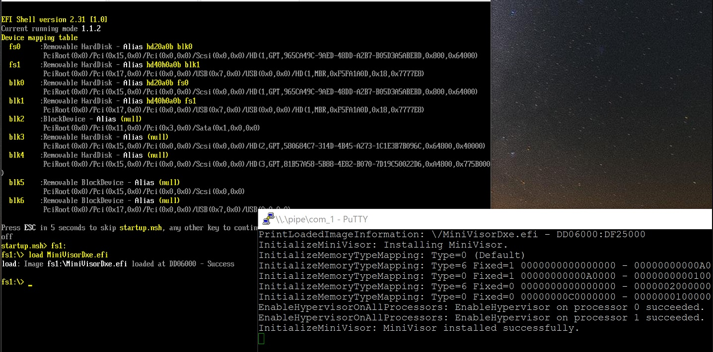
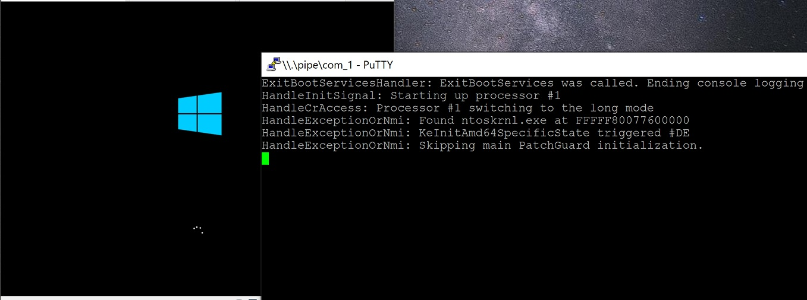

MiniVisor
==========

This is a research hypervisor written as a UEFI and Windows driver for the educational purpose for Intel processors.

This MiniVisor, as a UEFI driver, provides the ability to inspect system activities even before the operating system boots, while as a Windows driver, allows developers to debug it with familiar tools like WinDbg.

Showcase
---------

* Loading the hypervisor from the UEFI shell.

* Logging boot activities and interacting with the guest.

Motivation
-----------

The goal of this project is to share an additional learning resource for writing UEFI hypervisors with the community and researchers.

There are numerous open source hypervisors with small and easy-to-study implementations, but those that support booting operating systems as UEFI drivers are still not many.

Given the universality of UEFI systems on the AMD64 ecosystem and the unique ability to monitor, attack and protect the system throughout operating system startup on bare-metal systems, the authors believe that having the understanding and being able to author this type of hypervisors are valuable for research.

With this goal in mind, the project aims to offer
- Straightforward and approachable codebase
    - over highly-abstracted but intricate structures
- Rich comments aimed for new learners
    - over just-enough for those who already know how hypervisor works
- Minimal functionality to highlight core concepts to study
    - over extensibility and direct usefulness
- Extensive documentation on development environment setup

System Requirements
--------------------

Common Requirements:
- Intel VT-x and EPT supported processors

Requirements for the UEFI driver:
- UEFI-based system
- 64bit Windows 10 and Windows 10 IoT Core to boot

Requirements for the Windows driver:
- 64bit Windows 7 and 10

See [Building and Debugging](Docs/Building_and_Debugging.md) for testing.

Advantages and Use Cases
------------------------

While this project does not implement any immediately useful features, UEFI-based hypervisors have multiple advantages over Windows driver-based ones and can implement unique features.

* No need of disabling Hyper-V (Virtualization Based Security) to run the custom hypervisor
* No need of enabling the test-signing mode
* Zero direct indicator of existence of the hypervisor from Windows perspective
* Installing hooks during the early boot phase and letting PatchGuard to protect them
* Detecting bootkit and early system modification

Limitations
------------

- Nested virtualization is not supported. The CPUID instruction reports that the VMX extension is unsupported.
- Booting Windows SKUs other than the listed above, as well as Linux are not supported or tested.
- Sleep and resume are not supported or tested.

Acknowledgments
----------------

The authors thank for creators and maintainers of the following projects:
- [Bareflank](https://github.com/Bareflank/hypervisor) and [STM](https://github.com/jyao1/STM) -- for publishing UEFI-base hypervisors with the relatively small codebase.
- [zpp_hypervisor](https://github.com/eyalz800/zpp_hypervisor) -- for making me realize that writing UEFI-based hypervisors is viable.
- [EfiGuard](https://github.com/Mattiwatti/EfiGuard) -- for clean codebase and rich documentation for UEFI development newbies.
- [hvpp](https://github.com/wbenny/hvpp) -- for few techniques required for the UEFI environment.
- [ia32-doc](https://github.com/wbenny/ia32-doc) -- for saving me from defining thousands of constants and structures by hand.
